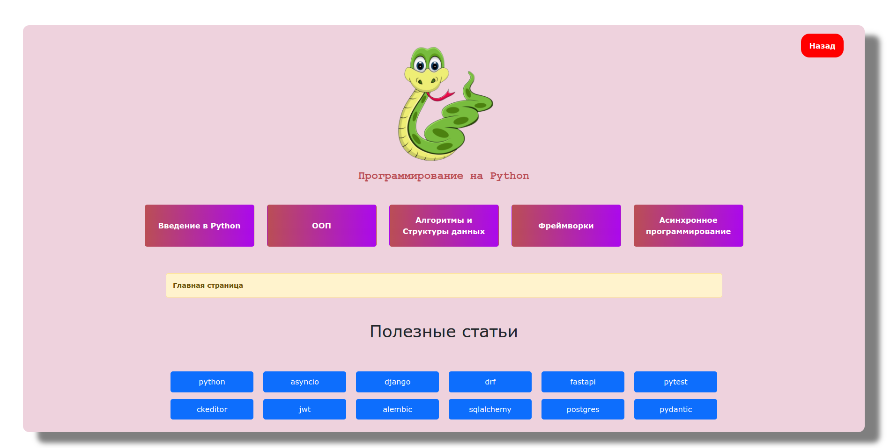

#   Проект "Изучение языка программирования Python"
---

### Подробнее
>   Данный проект представляет из себя веб приложение для изучения языка программирования Python. Помимо основных технологий, есть информация о фреймворках Django и FastAPI. Приложение создано с использованием Django REST Framework. Frontend часть написана на Vue.js. Так же есть материал на такие темы, как "Асинронное программирование", "Многопоточность", "Основы алгоритмизации и структуры данных".

---

#### Backend
>   
    - django
    - django rest framework
    - django-extensions
    - django-cors-headers
    - django-ckeditor-5
    - celery
    - redis

#### Frontend
>   
    - vue.js
    - vue router
    - axios
    - pinia
    - bootstrap
    - bootstrap-vue